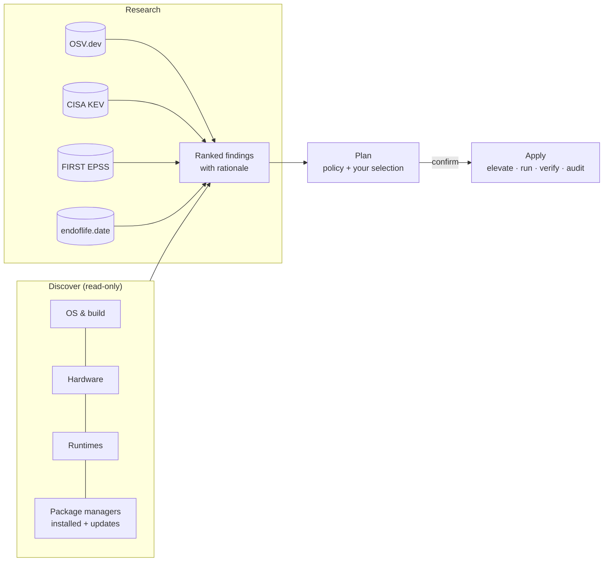

# patchscope

[](https://github.com/RobS96/patchscope/actions/workflows/ci.yml)
[](https://github.com/RobS96/patchscope/actions/workflows/e2e.yml)
[](https://github.com/RobS96/patchscope/security/code-scanning)
[](https://scorecard.dev/viewer/?uri=github.com/RobS96/patchscope)
[](LICENSE)

**Find out what a computer runs, what about it is vulnerable or out of
support, and fix it — on Windows, macOS and Linux, from a desktop app or
the command line.**

patchscope inventories the operating system, hardware and installed
software, researches each finding against public evidence, ranks what
matters most, and installs the updates you approve through the system's
own package managers, then checks they actually landed.

| It discovers | It researches against | It updates through |
|---|---|---|
| OS version, build, kernel, architecture · model, firmware, CPU, memory, disks, GPUs, battery health, temperatures · language runtimes · every package the system's managers know about | [OSV.dev](https://osv.dev) vulnerabilities · [CISA KEV](https://www.cisa.gov/known-exploited-vulnerabilities-catalog) (exploited in the wild) · [FIRST EPSS](https://www.first.org/epss/) (exploit probability) · [endoflife.date](https://endoflife.date) (support lifecycles) | macOS Software Update, Homebrew, Mac App Store · Windows Update, winget, Chocolatey · APT, DNF, pacman, Flatpak, Snap · npm (global), rustup |

## Quick start

### 1. Download

Get the archive for your system from the
[latest release](https://github.com/RobS96/patchscope/releases/latest):

| System | File |
|---|---|
| Windows 10/11 (x64) | `patchscope-vX.Y.Z-windows-x86_64.zip` |
| macOS 11+ (Intel and Apple silicon) | `patchscope-vX.Y.Z-macos-universal.tar.gz` |
| Linux x86_64 (glibc 2.35+: Ubuntu 22.04+, Debian 12+, Fedora, Arch …) | `patchscope-vX.Y.Z-linux-x86_64.tar.gz` |

Each archive holds the desktop app (`patchscope-gui`), the command-line
tool (`patchscope`), the licence, the changelog and a CycloneDX SBOM of
every dependency inside the binaries.

<details>
<summary>Verify the download (recommended)</summary>

Every release file is listed in a `SHA256SUMS-<platform>.txt` and carries a
signed [build provenance attestation](https://docs.github.com/actions/security-for-github-actions/using-artifact-attestations)
proving it was built by this repository's CI from a signed tag:

```bash
gh attestation verify patchscope-v0.1.0-linux-x86_64.tar.gz \
  --repo RobS96/patchscope --signer-workflow RobS96/patchscope/.github/workflows/ci.yml
sha256sum -c SHA256SUMS-linux-x86_64.txt
```

Releases after v0.1.0 also attach that attestation as
`patchscope-<version>-provenance.sigstore.json`. Add
`--bundle patchscope-<version>-provenance.sigstore.json` to the command above
to check against the attached copy instead of fetching it from GitHub.
</details>

### 2. Run the app

- **Windows:** unzip, then double-click `patchscope-gui.exe`. To install
  Windows Update or Chocolatey updates, right-click it and choose
  **Run as administrator**.
- **macOS:** extract, then run `./patchscope-gui` from Terminal. The
  binaries are not yet notarised ([why, and the plan](docs/code-signing.md)),
  so Finder blocks a double-click. To allow
  it once: `xattr -d com.apple.quarantine patchscope-gui patchscope`.
- **Linux:** extract and run `./patchscope-gui`. You'll get a graphical
  password prompt when an update needs root.

Click **Scan this computer**. A scan takes from a few seconds to a few
minutes; the OS update services are the slowest part. Then:

1. **Overview** shows counts by severity, actively exploited issues and the
   most important findings.
2. **Findings** explains each one: the evidence, the advisories, CVSS,
   whether it is being exploited, and the fix.
3. **Updates** lists what can be installed, already ticked. Narrow it with
   *Critical & high only*, or tick individual updates. Each row shows the
   exact command that will run.
4. **Install selected** shows a confirmation listing every command. Nothing
   changes until you click **Install now**. Progress and results, verified
   or not, appear under **Activity**.

### 3. Or use the command line

```bash
patchscope scan                       # inventory + research, ranked findings
patchscope apply --dry-run            # the exact commands it would run
patchscope apply                      # review, confirm, install, verify
patchscope apply --min-severity high  # only what matters most
```

See the [user guide](docs/user-guide.md) for every command and option.

## How it decides what matters

Each finding gets a severity from the evidence, not just "a newer version
exists":

| Severity | Evidence |
|---|---|
| **Critical** | an advisory in CISA's Known Exploited Vulnerabilities catalogue · CVSS ≥ 9.0 · the OS itself is past end of support |
| **High** | CVSS 7.0–8.9 · EPSS ≥ 10 % · a vendor-flagged security update (incl. OS updates with security content) · a language runtime past end of life · OS support ending within 90 days |
| **Medium** | CVSS 4.0–6.9, or an advisory with no score · a pending OS update · low free space for updates · runtime support ending soon |
| **Low** | a newer version with no known advisory · minor hardware notes |
| **Info** | a new major OS version (reported, never auto-installed) · a source that could not be queried |

Findings within a severity are ordered by a 0–100 risk score combining
CVSS, KEV listing and EPSS probability. Every finding says *why*, in plain
language, with links to the advisories. The full method, its sources and
its limits are in [docs/methodology.md](docs/methodology.md).

## Safe by design

- **Nothing changes without consent.** Discovery and research are read-only
  and need no privileges. Installing always shows the exact commands first;
  the CLI asks for confirmation (or requires `--yes`), and so does the app.
- **No shell.** Commands are run as argument vectors, never through a shell.
  Every package identifier is checked against what its manager lists (no
  paths, URLs or options), and Windows Update IDs must be GUIDs before
  they reach PowerShell.
- **A policy you control** ([`patchscope.toml`](docs/user-guide.md#policy)):
  protected packages (Xcode and its Command Line Tools by default, kept
  even when you add your own), no major OS upgrades unless
  allowed, security-only mode, a minimum severity and a cap on actions. A
  typo in the policy is an error, never a silent default.
- **Verified, audited, one at a time.** After installing, each package
  manager is queried again to confirm the update is gone. Every action is
  appended to an audit log (`audit.jsonl`, mode 0600). A lock file stops
  two runs from overlapping.
- **Bounded.** Every external command and network request has a timeout.
  A timed-out tool is asked to stop, then killed along with anything it
  started; if an administrator command times out, nothing further runs.
- **Private by default.** Hostname, serial number and MAC addresses are left
  out of reports unless you ask for them. Research requests send package
  names and versions to OSV.dev and CVE ids to FIRST, nothing about you.
- **Never restarts the machine.** Updates that need a restart say so; when
  to restart is your call.

More in [docs/safety.md](docs/safety.md) and [SECURITY.md](SECURITY.md).

## Platform support

| | Windows | macOS | Linux |
|---|---|---|---|
| OS & hardware inventory | ✔ | ✔ | ✔ |
| OS updates | Windows Update | Software Update | via APT / DNF / pacman |
| Packages & apps | winget, Chocolatey | Homebrew, Mac App Store | APT, DNF, pacman, Flatpak, Snap |
| Vulnerability matching (OSV) | npm | npm | Debian, Ubuntu, Rocky, Alma packages + npm |
| Lifecycle (endoflife.date) | Windows 10/11, Server | macOS | Ubuntu, Debian, Fedora, RHEL, Rocky, Alma, Alpine, SUSE, Mint … |
| Runtimes | Python, Node.js, Go, Ruby, PHP on all three |||

Homebrew, winget, Chocolatey, the Mac App Store, Flatpak, Snap and pacman
are not indexed by any public vulnerability database, so for those
patchscope reports available updates and says so in every report.
Details: [docs/platform-support.md](docs/platform-support.md).

## How it works



The workspace has three crates:

| Crate | What it is |
|---|---|
| [`patchscope-core`](patchscope-core) | Discovery, the 13 package-manager adapters, research clients, analysis, planning, applying, reports. Every external command goes through one runner trait, so all of it is tested against recorded output on any OS. |
| [`patchscope-cli`](patchscope-cli) | The `patchscope` command. |
| [`patchscope-gui`](patchscope-gui) | The desktop app (egui), driven by the same core. |

Design notes: [docs/architecture.md](docs/architecture.md).

## Build from source

Rust 1.95 or newer ([rustup.rs](https://rustup.rs)). On Linux the app needs
windowing headers to build:

```bash
sudo apt-get install -y libx11-dev libxkbcommon-dev libxkbcommon-x11-dev libgl1-mesa-dev pkg-config
```

```bash
git clone https://github.com/RobS96/patchscope.git && cd patchscope
cargo build --release --workspace
./target/release/patchscope-gui      # or ./target/release/patchscope scan
```

## Testing

Every push is tested on Linux, macOS and Windows, at three levels:

1. **Unit and pipeline tests** (`cargo test --workspace`): every parser
   against recorded tool output, research against recorded API responses,
   and the full inventory → research → plan → apply → verify path with fake
   commands, including policy exclusions, dry runs, privilege handling, the
   lock and the audit log.
2. **GUI tests:** the real app driven through its accessibility tree (scan,
   review, select, confirm, install, cancel, dry run, policy validation,
   export).
3. **End-to-end on real systems** ([e2e.yml](.github/workflows/e2e.yml),
   also weekly): on Windows, macOS and Ubuntu runners a known-vulnerable
   package is planted, then found, researched against the live services,
   installed, verified and confirmed gone on a rescan, and the GUI is
   started on each OS. In Debian 13, Ubuntu 24.04, Fedora 44 and Arch containers every
   available system update is installed and the distribution's own package
   manager must report nothing left. The live research APIs are checked
   against the parsers' expectations.

Plus fuzzing ([fuzz.yml](.github/workflows/fuzz.yml): libFuzzer over every
parser and the whole analyse → plan → report path, checking that nothing
unsafe is ever planned and no report contains a script), `cargo deny`
(advisories, licences, sources), `cargo vet` (supply chain), CodeQL,
OpenSSF Scorecard, and dependency review on pull requests.
See [docs/testing.md](docs/testing.md).

## Documentation

- [User guide](docs/user-guide.md): GUI, every CLI command, the policy file, exit codes, automation
- [Methodology](docs/methodology.md): sources, severity rubric, risk score, limitations
- [Safety model](docs/safety.md): what patchscope will and won't do, privileges, auditing
- [Architecture](docs/architecture.md): crates, data flow, adding a package manager
- [Platform support](docs/platform-support.md): per-OS details and known caveats
- [Testing](docs/testing.md): how it is tested and how to run each level
- [Code signing](docs/code-signing.md): what signing needs and how to switch it on
- [Contributing](CONTRIBUTING.md) · [Security policy](SECURITY.md) · [Changelog](CHANGELOG.md)

## License

[MIT](LICENSE)
