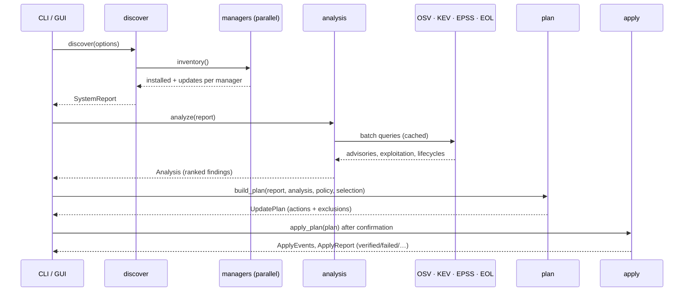

# Architecture

## Crates

```
patchscope-cli ──┐
                 ├──▶ patchscope-core
patchscope-gui ──┘
```

Both front ends are thin: everything that knows about operating systems,
package managers, research sources or safety lives in `patchscope-core`.

## patchscope-core modules

| Module | Responsibility |
|---|---|
| `model` | The serialisable data: `SystemReport`, `Analysis`, `Finding`, `Advisory`, `AvailableUpdate`, `Scan`. `SCHEMA_VERSION` is bumped when a field is removed or changes meaning. |
| `exec` | `CommandRunner`, the only way anything is executed. `SystemRunner` resolves programs on an extended `PATH` (GUI apps start with a minimal one), runs them without a shell, drains output on threads, enforces timeouts and kills process trees. `FakeRunner` replays recorded output and records every command for tests. Elevation wrappers (`sudo`, `pkexec`, macOS prompt) live here. |
| `discover` | OS (`os`), hardware (`hardware`), runtimes (`runtimes`), then all package managers **in parallel** (scoped threads), since Software Update and Windows Update can take minutes. |
| `managers` | One adapter per package source behind the `Manager` trait: `installed`, `updates`, `install_command`, `refresh_command`, `upgrade_all_only`. Adapters are pure parsers plus command builders, unit-tested on recorded output. |
| `research` | `http` (an `HttpClient` trait, the real rustls client, an on-disk cache that also powers offline mode, `FakeHttp`), and one module per source: `osv`, `kev`, `epss`, `eol`. |
| `analysis` | Joins discovery and research into ranked `Finding`s ([methodology](methodology.md)). Each source can fail independently; the analysis records its status and continues. |
| `policy` | `patchscope.toml`: parse strictly (`deny_unknown_fields`), match protected patterns. |
| `plan` | Selection + policy → ordered `PlannedAction`s and `Excluded` reasons. Order: user-level managers, then applications, then system packages, then OS updates (which may need a restart). |
| `apply` | Lock → for each action: elevate, run, record → verify by re-querying → audit. Emits `ApplyEvent`s for live progress. `plan_from_saved` plans a saved scan against this machine's live manager listings (`apply --from`). |
| `report` | Markdown and self-contained HTML renderings. |
| `paths` | Platform cache/config/data directories. |
| `util` | Dates without a date library, version comparison, globbing. |

## Data flow



## The GUI

`patchscope-gui` is an [egui](https://github.com/emilk/egui) app (glow
renderer, accesskit for screen readers). Scans and installs run on a
worker thread that sends progress messages over a channel, so the window
stays responsive. The app talks to the system only through the `Backend`
trait; the UI tests substitute a recorded backend and click through the
real app via its accessibility tree (`egui_kittest`).

## Adding a package manager

1. Add a variant to `model::ManagerId` (and `ALL`, `as_str`,
   `display_name`).
2. Implement `managers::Manager` in the right platform file: parse the
   listing commands' output into `Package`s and `AvailableUpdate`s, and
   build the install command. Use `run_list` for listing (it handles
   timeouts and non-zero "success" codes) and set a timeout on every
   command.
3. Set `ecosystem` on packages if OSV indexes them.
4. Register it in `managers::get` and decide its stage in `plan::stage`.
5. Unit-test the parsers on real recorded output (put larger samples in
   `patchscope-core/tests/fixtures/`), including the empty and error
   cases, and the install command's exact arguments.
6. Document it in [platform-support.md](platform-support.md) and
   [safety.md](safety.md#what-apply-runs).

## Adding a research source

Implement a module under `research/` that takes `&dyn HttpClient` (so it
is cached, offline-capable and testable), record a real response as a
fixture, wire it into `analysis::analyze` with its own `SourceStatus`, and
add a `--ignored` live test in `tests/live.rs` so the weekly end-to-end run
notices if the upstream format changes.
